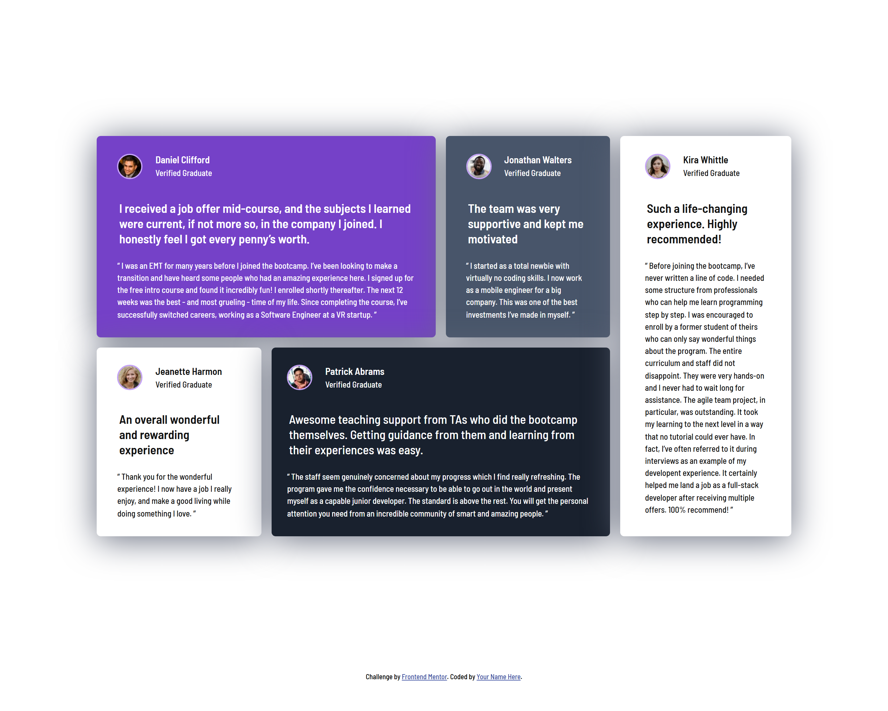

# Frontend Mentor - Testimonials Grid Section Solution

This is a solution to the [Testimonials Grid Section challenge on Frontend Mentor](https://www.frontendmentor.io/challenges/testimonials-grid-section-Nnw6J7Un7). Frontend Mentor challenges help you improve your coding skills by building realistic projects.

## Table of Contents

- [Overview](#overview)
  - [The Challenge](#the-challenge)
  - [Screenshot](#screenshot)
  - [Links](#links)
- [My Process](#my-process)
  - [Built With](#built-with)
  - [What I Learned](#what-i-learned)
  - [Continued Development](#continued-development)
  - [Useful Resources](#useful-resources)
- [Author](#author)
- [Acknowledgments](#acknowledgments)

## Overview

### The Challenge

Users should be able to:

- View the optimal layout depending on their device's screen size
- Read testimonials in a visually structured and responsive grid

### Screenshot

(./screenshots/mobile-view.png)

### Links

- [Solution URL](#) – Add your solution URL here
- [Live Site URL](#) – Add your live site URL here

## My Process

### Built With

- **Semantic HTML5** markup
- **CSS custom properties**
- **SASS/SCSS for styling**
- **Flexbox** and **CSS Grid**
- **Mobile-first workflow**
- **ARIA roles and attributes** for accessibility

### What I Learned

This project helped me improve my understanding of **CSS Grid layout**, **SASS/SCSS nesting**, and **accessibility best practices**.  

One of the key takeaways was using **CSS Grid** for structuring the layout dynamically for different screen sizes:

```scss
@media (min-width: 1024px) {
  .cards-container {
    display: grid;
    grid-template-columns: repeat(4, 1fr);
    grid-template-rows: repeat(2, auto);
    gap: 1rem;
  }

  .card.purple {
    grid-column: span 2;
  }

  .card.dark-blue {
    grid-column: span 2;
  }

  .card.white {
    grid-row: span 2;
  }
}

I also used SASS mixins to apply background colors dynamically:

@mixin card-background($color) {
  background-color: $color;
}

.card {
  &.purple { @include card-background($Purple500); }
  &.grey { @include card-background($Grey500); }
  &.white { 
    @include card-background($White);
    color: $Black;
  }
  &.dark-blue { @include card-background($Darkblue); }
}

Continued Development

In future projects, I want to:

Explore more advanced SASS features like functions and conditionals

Improve ARIA roles for better screen reader support

Experiment with CSS animations for UI enhancements


Useful Resources

MDN Web Docs - CSS Grid – Helped structure the grid layout effectively

SASS Official Docs – Improved my use of mixins and variables

A11y Project - ARIA Roles – Helped ensure better accessibility


Author

Website – Your Name

Frontend Mentor – @yourusername

Twitter – @yourusername


Acknowledgments

A big thanks to the Frontend Mentor community for providing challenges that help developers level up their skills. Also, thanks to MDN, CSS Tricks, and the SASS documentation for guiding my learning.